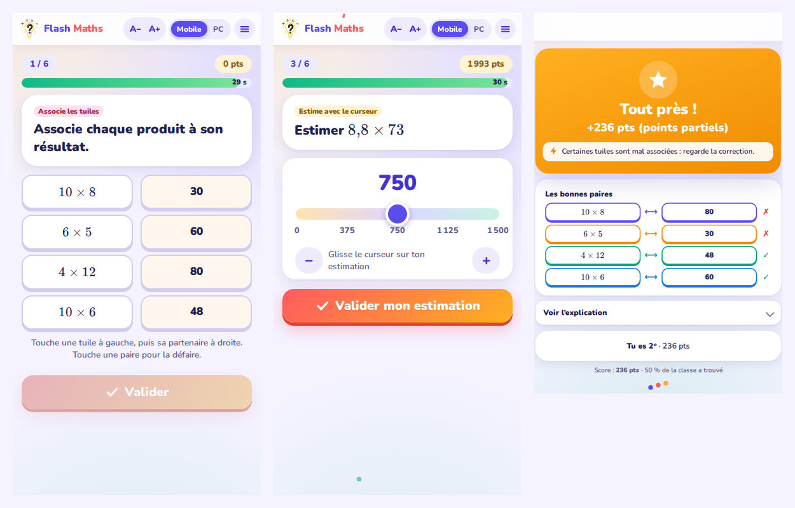

  

<h1 align="center">Flash Maths</h1>

  <b>Des questions flash de mathématiques, en direct au tableau et sur les téléphones.</b> 
  Automatismes, questions de cours et calcul pour le <b>CAP</b>, le <b>Bac Pro</b> et la <b>3ᵉ Prépa-Métiers</b>.

  <a href="https://VOTRE-IDENTIFIANT.github.io/flash-maths/"><b>▶ Ouvrir l’application</b></a> ·
  <a href="https://VOTRE-IDENTIFIANT.github.io/flash-maths/prof.html">Espace prof</a> ·
  <a href="https://VOTRE-IDENTIFIANT.github.io/flash-maths/eleve.html">Espace élève</a>

---

## En bref

Le prof choisit des notions, vérifie les questions générées puis ouvre une salle. Les élèves rejoignent la partie sur leur téléphone avec un **code à 4 caractères** (ou un QR code) et un **pseudo**. Les réponses restent cachées au tableau jusqu’à la correction, puis les scores, les animations et le podium s’affichent.

  

  

## Fonctionnalités

**Côté prof**
- Notions classées par **niveau** (3ᵉ PM, CAP, 2nde, 1ʳᵉ, Tle) puis par chapitre, avec une recherche par mot-clé.
- **Surprends-moi** : quelques notions tirées au sort dans le niveau choisi.
- Bouton **Générer** : on voit toutes les questions avant de jouer et on les modifie d’un clic (texte, réponses, temps, explication). On peut aussi les réordonner par glisser-déposer ou faire un nouveau tirage.
- **Import de questions** par simple texte : un `*` devant la bonne réponse, `= 4,5` pour une saisie libre.
- Temps de réponse : automatique, 15 s, 30 s, 1, 2 ou 5 min, ou un temps propre à chaque notion.
- En jeu : **+30 s**, **Corriger maintenant**, **Écourter** (passe directement au podium).
- En fin de partie : bilan par élève et par question, exports CSV, historique.
- Affichage **Projection** ou **Mobile**, et zoom **A− / A+** toujours visible.

**Trois modes de jeu**
| Mode | Principe | Animation |
|---|---|---|
| **Un contre tous** | Chacun joue pour soi | Top 5 en direct, podium des 3 meilleurs |
| **Duel d’équipes** | Les élèves glissent leur pseudo dans une équipe ; le prof peut renommer les équipes | Course de fusées, podium des équipes |
| **La Classe VS le Prof** | Les bonnes réponses blessent le prof, les erreurs blessent la classe | Combat illustré avec barres de vie |

**Côté élève**
- Connexion très simple : code, pseudo personnalisé (les pseudos grossiers sont refusés), et c’est parti.
- QCM, Vrai/Faux, **saisie libre avec clavier virtuel** (chiffres, virgule, signe moins, %, et x pour le calcul littéral).
- Toutes les écritures équivalentes sont acceptées : `4,5` = `4,50` = `450 %` = `9/2`, et `3x + 2` = `2 + 3x`.
- Effets visuels : « Éclair ! », « Sur le fil ! », confettis, séries.
- **Entraînement seul**, hors connexion, avec une difficulté qui s’adapte, plus un **carnet** de points, paliers et badges.

**Contenu** : 88 notions, des familles de questions à valeurs aléatoires (dont les mauvaises réponses correspondent à des erreurs fréquentes) et des questions de cours. Les formules sont écrites avec KaTeX.

## Installation (15 minutes, une seule fois)

L’application est faite de pages statiques hébergées sur **GitHub Pages**. Elle s’appuie sur une base **Supabase** gratuite pour les salles en direct.

1. **Supabase** : créez un projet (région Union européenne). Dans *SQL Editor*, collez le contenu de `flash_maths.sql` puis cliquez sur *Run*.
2. **config.js** : collez-y la *Project URL* et la clé publique *publishable / anon* de votre projet (jamais la clé *secret* ni *service_role*).
3. **GitHub Pages** : déposez les fichiers à la racine de ce dépôt, puis *Settings → Pages → Deploy from a branch → main / (root)*.
4. **Vérification** : ouvrez `prof.html`, puis menu ☰ → *Diagnostic de la base*. Les trois lignes doivent être vertes.

Le pas à pas détaillé, avec le dépannage, se trouve dans **`Notice_installation_Flash_Maths_v3.pdf`**.

### Fichiers du dépôt

| Fichier | Rôle |
|---|---|
| `index.html` | Accueil (prof / élève) et page « À propos » |
| `prof.html` | Espace prof |
| `eleve.html` | Espace élève |
| `contact.html` · `confidentialite.html` | Pages Contact et Confidentialité |
| `config.js` | Adresse et clé publique de la base Supabase |
| `readme-*.png` | Images de cette page |

Le fichier `flash_maths.sql` n’a pas besoin d’être en ligne : il se colle une fois dans Supabase.

## Capacité

- **30 élèves au maximum par salle** (vérifié par la base). Plusieurs salles peuvent être ouvertes en même temps sur des ordinateurs différents.
- L’offre gratuite de Supabase permet environ 200 connexions simultanées, soit environ 6 salles pleines, et 2 millions de messages temps réel par mois, soit environ 80 parties pleines de 20 questions. Un projet gratuit se met en pause après 7 jours sans activité : on le relance d’un clic (*Resume project*).

## Confidentialité

- **Aucun compte, aucun nom, aucun cookie, aucune publicité, aucun traceur.** Polices, formules et bibliothèques sont intégrées aux pages : aucun appel à un site extérieur, hormis votre propre base Supabase.
- La base ne garde que les codes de salle et les **pseudos** (effacés 4 h après la dernière activité). Elle garde aussi un **bilan pseudonyme** des parties pendant **30 jours**, rattaché à une « clé enseignant » enregistrée sous forme hachée.
- Les réponses circulent en direct vers le prof et ne sont jamais enregistrées. Le carnet de l’élève et les questions du prof restent dans le navigateur de l’appareil.
- Détails : page [Confidentialité](https://VOTRE-IDENTIFIANT.github.io/flash-maths/confidentialite.html) de l’application.

## Technique

HTML, CSS et JavaScript sans framework, avec des pages autonomes. Bibliothèques intégrées : [KaTeX](https://katex.org) (formules), [supabase-js](https://github.com/supabase/supabase-js) (base et temps réel), [qrcode-generator](https://github.com/kazuhikoarase/qrcode-generator) (QR code). Polices Nunito intégrées. Côté base : tables protégées par RLS, accessibles uniquement via des fonctions contrôlées.

## Auteur et licence

Conçu par **Tom Rougeaud**, professeur de mathématiques-sciences (académie de Dijon).
Suggestions et signalements de bugs : page [Contact](https://VOTRE-IDENTIFIANT.github.io/flash-maths/contact.html) de l’application ou [LinkedIn](https://linkedin.com/in/tomrougeaud).

Licence **[CC BY-NC 4.0](https://creativecommons.org/licenses/by-nc/4.0/deed.fr)** : utilisation, adaptation et partage libres, sans usage commercial, en citant l’auteur.
